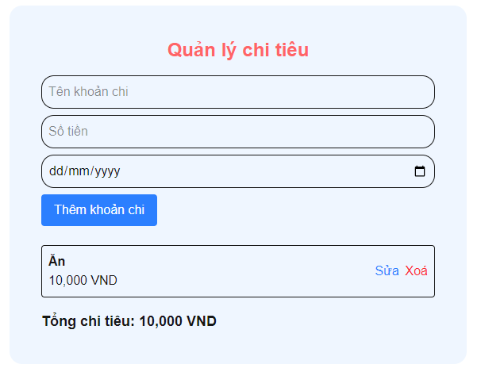
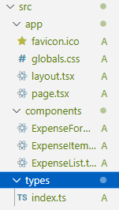

# 🧾 Quản lý chi tiêu


## 📌 Giới thiệu
Ứng dụng giúp người dùng ghi chép chi tiêu hàng ngày.

## 📌 Tính năng
- Ghi lại các khoản chi (tên, tiền, ngày)
- Hiển thị danh sách chi tiêu
- Tính tổng số tiền
- Thêm, sửa, xóa khoản chi
- Lưu dữ liệu bằng localStorage


## 🖼️ Giao diện

## 🚀 Cấu trúc thư mục


## 🚀 Cài đặt và chạy dự án
### Bước 1. Clone Project
```bash
git clone https://github.com/nhutit05/WSD_MHX2025.git
cd expense-manage
```
### Bước 2. Cài dependencies
```bash
npm install
```
### Bước 3. Chạy project
```bash
npm run dev
```
- Truy cập: http://localhost:3000


## ⚙️ Công nghệ sử dụng
- Next.js (React framework)
- TypeScript
- HTML, CSS (Tailwind hoặc thuần)
- localStorage (lưu dữ liệu)

## 📬 Liên hệ (nếu có)
Tên: Võ Minh Nhựt

Email: nhutb2303839@student.ctu.edu.vn


